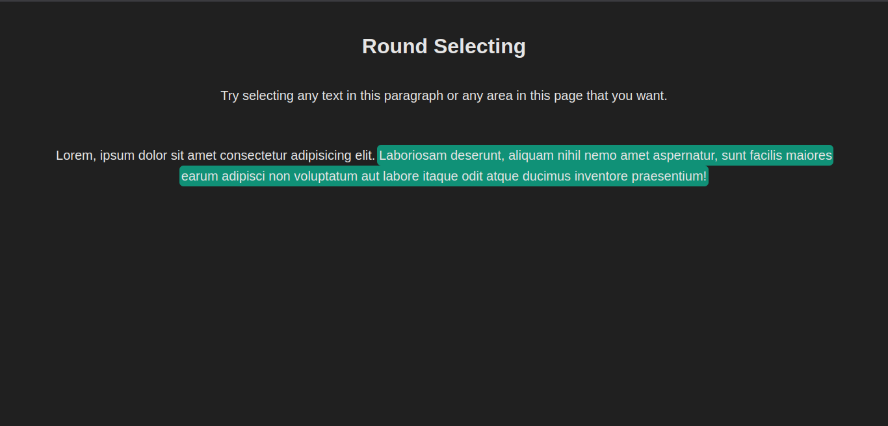

# 🎯 Round Selection Implementation

This is a simple **Round Selection** component built using **HTML, CSS, and JavaScript**.

## 🧪 Demo

👉 [Live Demo](https://hassanhajizadeh-roundSelection.netlify.app)

## 🛠️ Tech Stack

-   HTML5
-   CSS3
-   Vanilla JavaScript

## 📁 File Structure

```
roundSelection/
├── index.html
├── style.css
└── script.js
```

## Screenshot



## 🚀 How to Run Locally

1. Clone the repository:

    ```bash
    git clone https://github.com/hassanhajizadeh/roundSelection.git
    cd roundSelection
    ```

2. Open `index.html` in your browser.

## 📄 License

MIT License - free to use and modify.
